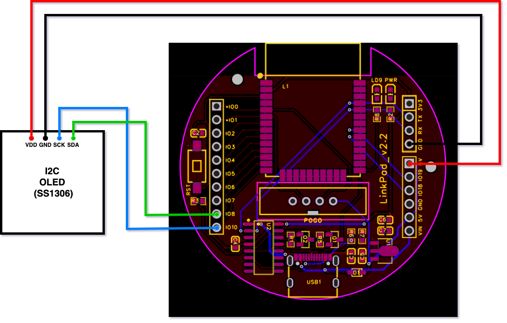

## 开发环境设备与设备烧录
开发环境的搭建参考官方教程： [搭建 ESP32 硬件开发的软件环境](https://docs.espressif.com/projects/esp-idf/zh_CN/v4.4.2/esp32/get-started/index.html)

### 连接设备
参考[连接设备](https://docs.espressif.com/projects/esp-idf/zh_CN/v4.4.2/esp32/get-started/index.html#get-started-connect)，将 ESP32 开发板连接到电脑上，并查看开发板使用的串口。

Windows 检查设备管理器中的 COM 端口列表即可

MacOS 和 Linux 执行下面的命令
```sh
ls -al /dev/cu.*    # MacOS
ls -al /dev/tty.*   # Linux
```

### 编译工程
[编译工程](https://docs.espressif.com/projects/esp-idf/zh_CN/v4.4.2/esp32/get-started/index.html#get-started-build)
```sh
idf.py build
```

### 烧录工程
[烧录到设备](https://docs.espressif.com/projects/esp-idf/zh_CN/v4.4.2/esp32/get-started/index.html#get-started-flash) 或者使用[监视器](https://docs.espressif.com/projects/esp-idf/zh_CN/v4.4.2/esp32/get-started/index.html#get-started-build-monitor) 监视设备运行情况
```sh
idf.py \
    -p /dev/cu.usbserial-110 \
    -b 460800 \
    flash
idf.py -p /dev/cu.usbserial-110 monitor # Ctrl+] 退出
```


## 构建项目
[构建系统（CMake 版](https://docs.espressif.com/projects/esp-idf/zh_CN/v4.4.2/esp32/api-guides/build-system.html#cmake)


[idf.py 工具](https://docs.espressif.com/projects/esp-idf/zh_CN/v4.4.2/esp32/api-guides/build-system.html#idf-py)


[C++开发](https://blog.csdn.net/m0_50064262/article/details/118695186)


## 开发板连线



| 开发板接口 | 连接   | 接口 | 说明 |
| ---------- | ------ | ---- | ---- |
| IO8        | OLED板 | SDA  |      |
| IO10       | OLED板 | SCK  |   I2C 时钟线   |


- OLED板连接
  - VDD: 3.3/5 V 供电
  - GND: 接地
  - SCK: I2C 时钟线
  - SDA: I2C 数据线